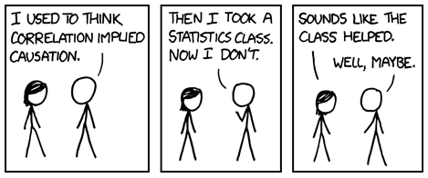
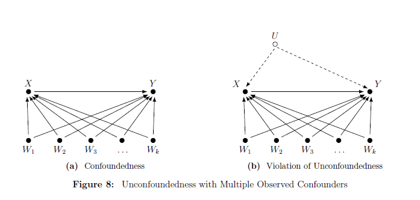
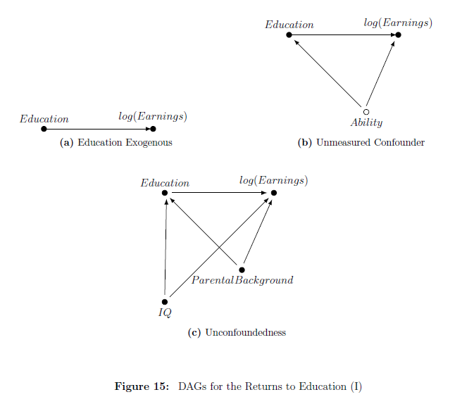
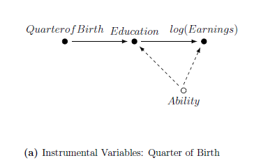
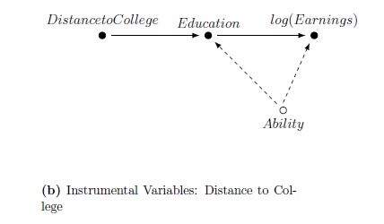
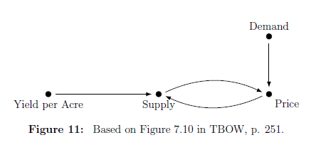

# Replicating this presentation

Use the [pacman](https://cran.r-project.org/web/packages/pacman/vignettes/Introduction_to_pacman.html) package to install and load packages:

```{r packages, message=FALSE, warning=FALSE}
if (!require("pacman"))
  install.packages("pacman")

pacman::p_load(
  tidyverse,   # for data wrangling and visualization
  tidymodels,  # for modeling
  haven,       # for reading dta files
  here,        # for referencing folders
  dagitty,     # for generating DAGs
  ggdag,       # for drawing DAGs
  knitr        # for printing html tables
)
```

```{r setup, include=FALSE}
options(htmltools.dir.version = FALSE)

knitr::opts_chunk$set(eval = TRUE,
                      echo = TRUE,
                      warning = FALSE,
                      message = FALSE,
                      cache = FALSE)

htmltools::tagList(rmarkdown::html_dependency_font_awesome())

set.seed(1203)
```


---

# Outline

- [Causal Inference](#caus)

- [Potential Outcomes](#pot)

- [Directed Acyiclic Graphs](#pot)

- [Simulations](#sim)


---
class: title-slide-section-blue, center, middle
name: caus

# Causal Inference


---
# Predicting vs. explaining

```{r, echo=FALSE, fig.align='center'}

```

Source: [XKCD](https://xkcd.com/552/)

---
# Looking forward

- Until now, our focus was on prediction.

- However, what we economists mostly care about is causal inference:
  - What is the effect of class size on student performance?
  - What is the effect of education on earnings?
  - What is the effect of government spending on GDP?
  - etc.
  
- Before we learn how to adjust and apply ML method to causal inference problems, we need to be explicit about what causal inference is.

- This lecture will review two dominant approaches to causal inference, the statistical/econometric approach and the computer science approach.


---
# Pearl and Rubin
```{r, echo=FALSE, fig.align='center'}

```

__Source__: The Book of Why (Pearl and Mackenzie)


---
# A note on identification

- The primary focus of this lecture is on identification, as opposed to prediction, estimation and inference.

- In short, identification is defined as

_"model parameters or features being uniquely determined from the observable population that generates the data."_ - (Lewbel, 2019)

- More specifically, think about identifying the parameter of interest when you have unlimited data (the entire population).

---
class: title-slide-section-blue, center, middle
name: pot

# Potential Outcomes

---
# The road not taken

```{r, echo=FALSE, out.width = "100%", fig.align='center'}

```


Source: [https://mru.org/courses/mastering-econometrics/ceteris-paribus](https://mru.org/courses/mastering-econometrics/ceteris-paribus)

---
# Notation

- $Y$ is a random variable

- $X$ is a vector of attributes

- $\mathbf{X}$ is a design matrix


---
# Treatment and potential outcomes (Rubin, 1974, 1977)

- Treatment

$$D_i=\begin{cases}
    1, & \text{if unit } i \text{ received the treatment} \\
    0, & \text{otherwise.}
\end{cases}$$

--

- Treatment and potential outcomes

$$\begin{matrix}
    Y_{i0} & \text{is the potential outcome for unit } i \text{ with } D_i = 0\\
    Y_{i1} & \text{is the potential outcome for unit } i \text{ with }D_i = 1
\end{matrix}$$


--

- Observed outcome: Under the Stable Unit Treatment Value Assumption (SUTVA), The realization of unit $i$'s outcome is

$$Y_i = Y_{1i}D_i + Y_{0i}(1-D_i)$$

--

__Fundamental problem of causal inference__ (Holland, 1986): We cannot observe _both_ $Y_{1i}$ and $Y_{0i}$.


---
# Treatment effect and observed outcomes

- Individual treatment effect: The difference between unit $i$'s potential outcomes:

$$\tau_i = Y_{1i} - Y_{0i}$$


--

- _Average treatment effect_ (ATE)

$$\mathbb{E}[\tau_i] = \mathbb{E}[Y_{1i}-Y_{0i}] = \mathbb{E}[Y_{1i}]-\mathbb{E}[Y_{0i}]$$

--


- _Average treatment effect for the treatment group_ (ATT)

$$\mathbb{E}[\tau_i | D_i=1] = \mathbb{E}[Y_{1i}-Y_{0i}| D_i=1] = \mathbb{E}[Y_{1i}| D_i=1]-\mathbb{E}[Y_{0i}| D_i=1]$$

__NOTE:__ The complement of the treatment group is the _control_ group.

---

# Selection bias


A naive estimand for ATE is the difference between average outcomes based on treatment status

However, this might be misleading:

$$\begin{aligned} \mathbb{E}\left[Y_{i} | D_{i}=1\right]-\mathbb{E}\left[Y_{i} | D_{i}=0\right] &=\underbrace{\mathbb{E}\left[Y_{1 i} | D_{i}=1\right]-\mathbb{E}\left[Y_{0i} | D_{i}=1\right]}_{\text{ATT}} +
\underbrace{\mathbb{E}\left[Y_{0 i} | D_{i}=1\right]-\mathbb{E}\left[Y_{0i} | D_{i}=0\right]}_{\text{selection bias}}
\end{aligned}$$


> __Causal inference is mostly about eliminating selection-bias__


__EXAMPLE:__ Individuals who go to private universities probably have different characteristics than those who go to public universities.

---

# Randomized control trial (RCT) solves selection bias

In an RCT, the treatments are randomly assigned. This means that $D_i$ is _independent_ of potential outcomes, namely

$$\{Y_{1i}, Y_{0i}\}  \perp D_i$$

RCTs enables us to estimate ATE using the average difference in outcomes by treatment status:

$$\begin{aligned} \mathbb{E}\left[Y_{i} | D_{i}=1\right]-\mathbb{E}\left[Y_{i} | D_{i}=0\right] &=\mathbb{E}\left[Y_{1 i} | D_{i}=1\right]-\mathbb{E}\left[Y_{0i} | D_{i}=0\right] \\ &=\mathbb{E}\left[Y_{1 i} | D_{i}=1\right]-\mathbb{E}\left[Y_{0 i} | D_{i}=1\right] \\
&= \mathbb{E}\left[Y_{1 i}-Y_{0 i} | D_{i}=1\right] \\
&= \mathbb{E}\left[Y_{1 i}-Y_{0 i}\right] \\
&= \text{ATE}
\end{aligned}$$

__EXAMPLE:__ In theory, randomly assigning students to private and public universities would allow us to estimate the ATE going to private school have on future earnings. Clearly, RCT in this case is infeasible.

---

# Estimands and regression


Assume for now that the treatment effect is constant across all individuals, i.e., 

$$\tau = Y_{1i}-Y_{0i},\quad \forall i.$$ 

Accordingly, we can express $Y_i$ as

$$\begin{aligned}
Y_i &= Y_{1i}D_i + Y_{0i}(1-D_i) \\
&= Y_{0i} + D_i(Y_{1i} - Y_{0i}), \\
&= Y_{0i} + \tau D_i, & \text{since }\tau = Y_{1i}-Y_{0i}\\
&= \mathbb{E}[Y_{0i}] + \tau D_i + Y_{0i}-\mathbb{E}[Y_{0i}], & \text{add and subtract } \mathbb{E}[Y_{0i}]\\
\end{aligned}$$

Or more conveniently

$$Y_i = \alpha + \tau D_i + u_i,$$

where $\alpha = \mathbb{E}[Y_{0i}]$ and $u_i = Y_{0i}-\mathbb{E}[Y_{0i}]$ is the random component of $Y_{0i}$.


---
# Unconfoundedness

Typically, in observational studies, treatments are not randomly assigned. (Think of $D_i = \{\text{private}, \text{public}\}$.) 


In this case, identifying causal effects depended on the _Unconfoundedness_ assumption (also known as "selection-on-observable"), which is defined as

$$\{Y_{1i}, Y_{0i}\}  \perp D_i | {X}_i$$
In words: treatment assignment is independent of potential outcomes _conditional_ on observable ${X}_i$, i.e., selection bias _disappears_ when we control for ${X}_i$.


---
# Adjusting for confounding factors


The most common approach for controlling for $X_i$ is by adding it to the regression:

$$Y_i = \alpha + \tau D_i + {X}_i'\boldsymbol{\beta} + u_i,$$
__COMMENTS__:

  1. Strictly speaking, the above regression model is valid if we actually _believe_ that the "true" model is $Y_i = \alpha + \tau D_i + {X}_i'\boldsymbol{\beta} + u_i.$ 
  
  2. If $D_i$ is randomly assigned, adding ${X}_i$ to the regression __might__ increases the accuracy of ATE.
  
  3. If $D_i$ is assigned conditional on ${X}_i$ (e.g., in observational settings), adding ${X}_i$ to the regression eliminates selection bias.


---
# Illustration: the OHIE data

- The Oregon Health Insurance Experiment (OHIE), is a randomized controlled trial for measuring the treatment effect of Medicaid eligibility.

- Treatment group: Those selected in the Medicaid lottery.

- The outcome, `doc_any_12m`, equals to 1 for patients who saw a primary care physician, and zero otherwise.


---
# Load the OHIE data

In this illustration we will join 3 separate (stata) files and load them to R using the [`{haven}`](https://haven.tidyverse.org/) package:
```{r}
descr <- 
  here("08-causal-inference/data",
       "oregonhie_descriptive_vars.dta") %>% 
  read_dta()

prgm <- 
  here("08-causal-inference/data",
       "oregonhie_stateprograms_vars.dta") %>% 
  read_dta()

s12 <- 
  here("08-causal-inference/data",
       "oregonhie_survey12m_vars.dta") %>% 
  read_dta()

```

The entire OHIE data can be found [here](http://nber.org/oregon/4.data.html).

---
# Preprocessing: Joining datasets

Join 3 data frames and remove empty responses:
```{r}
ohie_raw <- 
  descr %>% 
  left_join(prgm) %>% 
  left_join(s12) %>% 
  filter(sample_12m_resp == 1) %>% 
  drop_na(doc_any_12m)
```

---
# Preprocessing: Refinement

Select the relevant variables and re-level `numhh_list` (household size)
```{r}
ohie <- 
  ohie_raw %>% 
  dplyr::select(numhh_list, treatment, doc_any_12m) %>% 
  mutate(
    numhh_list = factor(numhh_list, levels = c("1", "2", "3"))
  )
```

---
# The final dataset

```{r}
ohie
```

---
# Distribution of treated-control

```{r}
ohie %>% 
  count(treatment) %>%
  kable(format = "html")
```

---
# Estimating ATE

The estimated model
$$doc\_any\_12m_i = \alpha + \tau\times selected_i + \varepsilon_i$$
In R:
```{r}
fit <- lm(doc_any_12m ~ treatment, data = ohie)
```

---
# Results
```{r}
fit %>% 
  tidy(conf.int = TRUE) %>% 
  filter(term != "(Intercept)") %>% 
  dplyr::select(term, estimate, starts_with("conf.")) %>% 
  kable(digits = 4, format = "html")
```

__Interpretation:__ being selected in the lottery increases the probability that you visit primary care physician in the following year by 5.72 [4.47, 7.97] percentage points.


---
# Adjustments

One issue with OHIE is that people are able to apply for Medicaid for their entire household.

This fact undermines the critical random assignment assumption since belonging to larger households increases the chances of being selected to Medicade.

```{r}
ohie %>% 
  count(treatment, numhh_list) %>% 
  kable(format = "html")
```


---
# ATE under adjustment for `numhh`

The model with adjustment:
$$doc\_any\_12m_i = \alpha + \tau\times selected_i + \beta\times numhh_i+ \varepsilon_i$$
Estimation:
```{r}
fit_adj <- lm(doc_any_12m ~ treatment + numhh_list, data = ohie)
```

---
# Results

```{r}
fit_adj %>% 
  tidy(conf.int = TRUE) %>% 
  dplyr::select(term, estimate, starts_with("conf.")) %>% 
  kable(digits = 4, format = "html")
```

After adjusting for `numhh`, ATE has increased from 5.72 to 6.35 percentage points. (Can you guess why?)


---
class: title-slide-section-blue, center, middle
name: pot

# Directed Acyclic Graphs


---
# DAGs

```{r, echo=FALSE, fig.align='center'}

```

[Source](https://i.imgflip.com/1xhtwh.jpg)

---
# What are DAGs?

.pull-left[
A DAG (directed acyclic graph) is a way to model a system of causal interactions using graphs.


- __Nodes__ represents random variables, e.g., $X$, $Y$, etc.
- __Arrows__ (or directed edges) represent "from $\rightarrow$ to" causal effects. For example, $Z\rightarrow X$ reads " $Z$ causes $X$".
- A __path__ is a sequence of edges connecting two nodes. For example, $Z\rightarrow X \rightarrow M \leftarrow Y$ describes a path from $Z$ to $Y$.
- In a __direct path__ arrows point to the same direction: $Z\rightarrow X \rightarrow M$
]
.pull-right[
```{r, echo=FALSE}
dag <- dagify(
  X ~ Z,
  M ~ X,
  M ~ Y
) 
dag %>% 
  ggdag(text_size = 12, node = FALSE, text_col = "black") +
  theme_dag()

```
]

---
# Confounder DAG

.pull-left[
- $X$ is a common cause of $D$ and $Y$.

- conditioning on $X$ removes dependency between $D$ and $Y$ through $X$.

- In DAG terms, controlling for X "closes the backdoor path" between $D$ and $Y$, and leaves open the direct path.

- The notion of closing the backdoor path is related to the notion of omitted variable bias.

]
.pull-right[
```{r, echo=FALSE}
dag <- dagify(
  D ~ X,
  Y ~ X,
  Y ~ D
) 
dag %>% 
  ggdag(layout = "tree", text_size = 12, node = FALSE, text_col = "black") +
  theme_dag()

```
]

---
#DAGs and SEM

- Another way to think about DAGs is as non-parametric __structural equation models__ (SEM)

- For example, the single-confounder DAG we've just seen can be represented by a set of three equations:  

$$\begin{array}{l}
X\leftarrow f_X\left(u_{X}\right) \\
D\leftarrow f_D\left(X, u_D\right)\\
Y\leftarrow f_Y(D,X,u_Y)
\end{array}$$
where 
- The $f_{i}$'s denote the causal mechanisms in the model. Are not restricted to be linear.
- $u_X,u_D$,and $u_Y$ denote independent background factors that the we chooses not to include in the analysis.
- Assignment operator $(\leftarrow)$ captures asymmetry of causal relationships.


---
# Unconfoundedness in DAGs

```{r, echo=FALSE, fig.align='center'}

```

Source: Imbens (2019).

---
# Example: Identifying the Returns to Education


```{r, echo=FALSE, fig.align='center', out.width='50%'}

```

Source: Imbens (2019).


---
# Instrumental variables in DAGs

.pull-left[
```{r, echo=FALSE, fig.align='center'}

```
Source: Imbens (2019).

]
.pull-right[
```{r, echo=FALSE, fig.align='center'}

```
]


---
# A mediator

.pull-left[
- $D$ causes $M$ causes $Y$.

- $M$ mediates the causal effect of $D$ on $Y$

- conditioning on $M$ removes dependency between $D$ and $Y$

- We've essentially closed a direct path (the only direct path between $D$ and $Y$.

]
.pull-right[
```{r, echo=FALSE}
dag <- dagify(
  Y ~ M,
  M ~ D
) 
dag %>% 
  ggdag(layout = "tree", text_size = 12, node = FALSE, text_col = "black") +
  theme_dag()

```
]


---
# A Collider

.pull-left[

- $D$ are $Y$ are independent.

- $D$ and $Y$ jointly cause $C$.

- conditioning on $C$ creates dependency between $D$ and $Y$

]
.pull-right[
```{r, echo=FALSE}
dag <- dagify(
  C ~ D,
  C ~ Y
) 
dag %>% 
  ggdag(layout = "mds", text_size = 12, node = FALSE, text_col = "black") +
  theme_dag()

```
]

---
# Example: "Bad controls"

.pull-left[
- "Bad controls" are variables that are themselves outcome variables.

- This distinction becomes important when dealing with high-dimensional data

__EXAMPLE:__ Occupation as control in a return to years of schooling regression.

Discovering that a person works as a developer in a high-tech firm changes things; knowing that the person does not have a college degree tells us immediately that he is likely to be very talented.
]
.pull-right[
```{r, echo=FALSE}
collider_triangle(m = "Developer", x = "College", y = "Talent") %>% 
  ggdag(use_labels = "label", text_size = 10) +
  theme_dag()
```
]


---
# Collider: M-bias

```{r, echo=FALSE, fig.align='center'}
m_bias(x = "Education", y = "Diabetes", a = "Income during\nChildhood", 
       b = "Genetic Risk \nfor Diabetes", m = "Mother's Diabetes") %>% 
  ggdag(text_size = 6, use_labels = "label") +
  theme_dag()
```


---
class: title-slide-section-blue, center, middle
name: sim

# Simulations


---
# Simulation I: De-counfounding

.pull-left[

Simulate the DGP:
```{r}
n <- 1000
p <- 3

u <- matrix(rnorm(n * p), n, p)

x <- u[,2]
d <- 0.8 * x + 0.6 * u[,1]
y <- 0 * d + 0.2 * x + u[,3]
```
Note that the "true" effect $D\rightarrow Y$ is zero (i.e., $ATE=0$).
]
.pull-right[
```{r, echo=FALSE}
dag <- dagify(
  Y ~ X,
  D ~ X
) 
dag %>% 
  ggdag(layout = "tree", text_size = 12, node = FALSE, text_col = "black") +
  theme_dag()

```
]

---
# Simulation I: De-counfounding (cont.)

.pull-left[
Raw correlation matrix:
```{r, echo=FALSE}
cor(cbind(y,x,d)) %>% 
  kable(digits = 1, format = "html")
```

__Note:__ $Y$ and $D$ are correlated even though there is no direct arrow between them. This is due to the confounder $X$ which opens a backdoor path between $Y$ and $D$.
]
.pull-right[
```{r, echo=FALSE}
dag <- dagify(
  Y ~ X,
  D ~ X
) 
dag %>% 
  ggdag(layout = "tree", text_size = 12, node = FALSE, text_col = "black") +
  theme_dag()

```
]

---
# Simulation I: De-counfounding (cont.)

.pull-left[

Let's estimate the model with $X$ on the right hand side:

```{r, echo=FALSE}
lm(y ~ d + x - 1) %>% 
  tidy() %>% 
  dplyr::select(term, estimate, p.value) %>% 
  kable(digits = 2, format = "html")
```

and without $X$
```{r, echo=FALSE}
lm(y ~ d - 1) %>% 
  tidy() %>% 
  dplyr::select(term, estimate, p.value) %>% 
  kable(digits = 2, format = "html")
```
  
__BOTTOM LINE:__ Controlling for $X$ provides the correct answer.
]
.pull-right[
```{r, echo=FALSE}
dag <- dagify(
  Y ~ X,
  D ~ X
) 
dag %>% 
  ggdag(layout = "tree", text_size = 12, node = FALSE, text_col = "black") +
  theme_dag()
```
]

---
# Simulation II: Mediator

.pull-left[
The DGP:
```{r}
n <- 1000
p <- 3

u <- matrix(rnorm(n * p), n, p)

d <- u[,1]
m <- 1.3 * d + u[,2]
y <- 0.1 * m + u[,3]
```

True effect of $D\rightarrow Y$ is $1.3\times 0.1 = 0.13$.
]
.pull-right[
```{r, echo=FALSE}
coords <- tribble(
  ~name, ~x, ~y,
  "D", 0, 0,
  "Y", 1, 0,
  "M", 0.5, 0
)
dag <- dagify(
 M ~ D,
 Y ~ M,
 exposure = "D",
 outcome = "Y",
 coords = coords
) 
dag %>% 
  ggdag(layout = "tree",text_size = 12, node = FALSE, text_col = "black") +
  theme_dag()

```
]

---
# Simulation II: Mediator (cont.)

.pull-left[
Raw correlation matrix:
```{r, echo=FALSE}
cor(cbind(y,m,d)) %>% 
  kable(digits = 1, format = "html")
```
  
In this case, both the mediator $M$ and the treatment $D$ are correlated with the outcome $Y$. 
]
.pull-right[
```{r, echo=FALSE}
coords <- tribble(
  ~name, ~x, ~y,
  "D", 0, 0,
  "Y", 1, 0,
  "M", 0.5, 0
)
dag <- dagify(
 M ~ D,
 Y ~ M,
 exposure = "D",
 outcome = "Y",
 coords = coords
) 
dag %>% 
  ggdag(layout = "tree",text_size = 12, node = FALSE, text_col = "black") +
  theme_dag()

```
]


---
# Simulation II: Mediator (cont.)

.pull-left[
Estimate the model with $M$:  

```{r, echo=FALSE}
lm(y ~ d + m - 1) %>% 
  tidy() %>% 
  dplyr::select(term, estimate, p.value) %>% 
  kable(digits = 2, format = "html")
```
  
and without $M$:  
```{r, echo=FALSE}
lm(y ~ d - 1) %>% 
  tidy() %>% 
  dplyr::select(term, estimate, p.value) %>% 
  kable(digits = 2, format = "html")
```

__BOTTOM LINE:__ Controlling for $M$ in this case biases the total effect of $D$ on $Y$ downward since it blocks the path from $D$ to $Y$.

]
.pull-right[
```{r, echo=FALSE}
coords <- tribble(
  ~name, ~x, ~y,
  "D", 0, 0,
  "Y", 1, 0,
  "M", 0.5, 0
)
dag <- dagify(
 M ~ D,
 Y ~ M,
 exposure = "D",
 outcome = "Y",
 coords = coords
) 
dag %>% 
  ggdag(layout = "tree",text_size = 12, node = FALSE, text_col = "black") +
  theme_dag()
```
]

---
# Simulation III: M-bias

.pull-left[
Generate the data:
```{r}
n <- 1000
p <- 3

u <- matrix(rnorm(n * p), n, p)

d <- u[,1]
x <- 0.8 * u[,1] + 0.2 * u[,2] + 0.6 * u[,3]
y <- 0 * d + u[,2]
```

Note that $X$ is a collider, and that the "true" effect $D\rightarrow Y$ is zero (i.e., $ATE=0$).
]
.pull-right[
```{r, echo=FALSE}
coords <- tribble(
  ~name, ~x, ~y,
  "D", 0, 0,
  "Y", 2, 0,
  "Ud", 0, 1,
  "Uy", 2, 1,
  "X",  1, 0.5
)

dag <- dagify(
  X ~ Uy + Ud,
  D ~ Ud,
  Y ~ Uy, 
  exposure = "X",
  outcome = "Y",
  coords = coords
) 
dag %>% 
  ggdag(layout = "tree",text_size = 12, node = FALSE, text_col = "black") +
  theme_dag()
```
]

---
# Simulation III: M-bias (cont.)

.pull-left[
Raw correlation matrix:
```{r, echo=FALSE}
cor(cbind(y,x,d)) %>% 
  kable(digits = 1, format = "html")
```

Notice how $Y$ is uncorrelated with $D$ and $X$ is correlated with both $D$ and $Y$.
]
.pull-right[
```{r, echo=FALSE}
coords <- tribble(
  ~name, ~x, ~y,
  "D", 0, 0,
  "Y", 2, 0,
  "Ud", 0, 1,
  "Uy", 2, 1,
  "X",  1, 0.5
)

dag <- dagify(
  X ~ Uy + Ud,
  D ~ Ud,
  Y ~ Uy, 
  exposure = "X",
  outcome = "Y",
  coords = coords
) 
dag %>% 
  ggdag(layout = "tree",text_size = 12, node = FALSE, text_col = "black") +
  theme_dag()
```
]


---
# Simulation III: M-bias

.pull-left[
Estimate the model with $X$  
```{r, echo=FALSE}
lm(y ~ d + x - 1) %>% 
  tidy() %>% 
  dplyr::select(term, estimate, p.value) %>%
  kable(digits = 2, format = "html")
```

and without $X$
```{r, echo=FALSE}
lm(y ~ d - 1) %>% 
  tidy() %>% 
  dplyr::select(term, estimate, p.value) %>% 
  kable(digits = 2, format = "html")
```

__BOTTOM LINE:__ Controlling for $X$ in this case results in finding a spurious effect of $D$ on $Y$ since it opens a backdoor path between $D$ to $Y$.

]
.pull-right[
```{r, echo=FALSE}
coords <- tribble(
  ~name, ~x, ~y,
  "D", 0, 0,
  "Y", 2, 0,
  "Ud", 0, 1,
  "Uy", 2, 1,
  "X",  1, 0.5
)

dag <- dagify(
  X ~ Uy + Ud,
  D ~ Ud,
  Y ~ Uy, 
  exposure = "X",
  outcome = "Y",
  coords = coords
) 
dag %>% 
  ggdag(layout = "tree",text_size = 12, node = FALSE, text_col = "black") +
  theme_dag()

```
]


---
# Limitations of DAGs

- Hard to write down a DAG for complicated (econometric) structural models.

- Need to specify the entire DGP (is it REALY a limitation?)

- Simultaneity: _"In fact it is not immediately obvious to me how one would capture supply and demand models in a DAG"_ (Imbens, forthcoming)

```{r, echo=FALSE, fig.align='center', out.width='55%'}

```


---
# Recommended introductory level resources on DAGs

- [The Book of Why](http://bayes.cs.ucla.edu/WHY/) by Pearl and Mackenzie.

- [Causal Inference in Machine Learning and Al](https://www.dropbox.com/s/ps4a0iwc0q51q9z/Hunermund%20-%20Causal%20Inference%20in%20ML%20and%20AI.pdf) by Paul Hünermund.

- [Causal Inference: The Mixtape (pp. 67-80)](https://www.scunning.com/mixtape.html) by Scott Cunningham.

- [Potential Outcome and Directed Acyclic Graph Approaches to Causality: Relevance for Empirical Practice in Economics](https://www.aeaweb.org/articles?id=10.1257/jel.20191597&&from=f) by Guido W. Imbens

- [A Crash Course in Good and Bad Controls](https://ftp.cs.ucla.edu/pub/stat_ser/r493.pdf) by Cinelli, Forney, and Pearl, J. (2020).

---
# Next time: Causal inference in high-dimensional setting

Consider again the standard "treatment effect regression":

$$Y_i=\alpha+\underbrace{\tau D_i}_{\text{low dimensional}} +\underbrace{\sum_{j=1}^{k}\beta_{j}X_{ij}}_{\text{high dimensional}}+\varepsilon_i,\quad\text{for }i=1,\dots,n$$
Our object of interest is $\widehat{\tau}$, the estimated _average treatment effect_ (ATE).  

In high-dimensional settings $k \gg n$.


---
class: .title-slide-final, center, inverse, middle

# `slides %>% end()`

[<i class="fa fa-github"></i> Source code](https://github.com/ml4econ/lecture-notes-2021/tree/master/08-causal-inference)  


---
# Selected references


Hünermund, P., & Bareinboim, E. (2019). Causal Inference and Data-Fusion in Econometrics. arXiv preprint arXiv:1912.09104.

Imbens, W. G. (forthcoming). Potential Outcome and Directed Acyclic Graph Approaches to Causality: Relevance for Empirical Practice in Economics. _Journal of Economic Literature_.

Lewbel, A. (2019). The identification zoo: Meanings of identification in econometrics. _Journal of Economic Literature_, 57(4), 835-903.