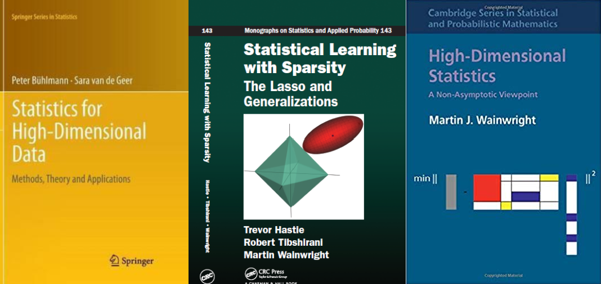
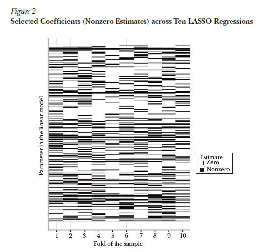
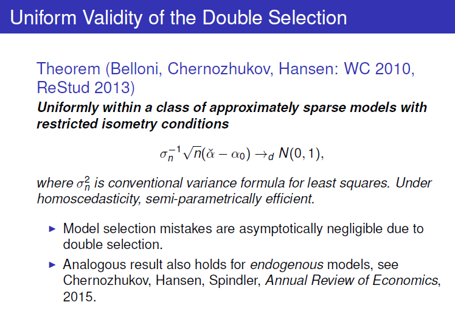
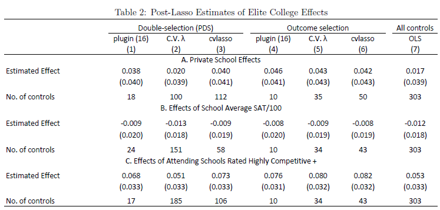
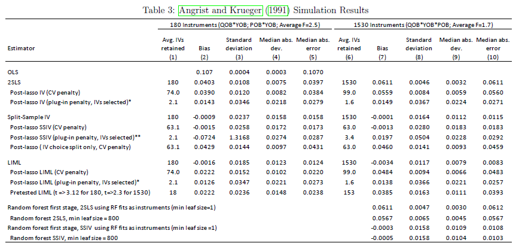

# Replicating this presentation

Use the [pacman](https://cran.r-project.org/web/packages/pacman/vignettes/Introduction_to_pacman.html) package to install and load packages:

```{r packages, message=FALSE, warning=FALSE}

if (!require("pacman"))
  install.packages("pacman")

pacman::p_load(
  tidyverse,
  tidymodels,
  hdm,
  ggdag,
  knitr,
  xaringan,
)
```

```{r setup, include=FALSE}
options(htmltools.dir.version = FALSE)

knitr::opts_chunk$set(eval = TRUE,
                      echo = TRUE,
                      warning = FALSE,
                      message = FALSE,
                      cache = FALSE)

htmltools::tagList(rmarkdown::html_dependency_font_awesome())
```

```{r plots_and_figures, include=FALSE}

ggplot2::theme_set(theme_light(15))

```


---

# Outline

- [Lasso and Variable Selection](#sel)

- [High Dimensional Confoundedness](#ate)

- [Empirical Illustration using `hdm`](#hdm)


---
class: title-slide-section-blue, center, middle
name: sel

# Lasso and Variable Selection


---

# Resources on the theory of Lasso

.pull-left[
- [_Statistical Learning with Sparsity - The Lasso and Generalizations_](https://web.stanford.edu/~hastie/StatLearnSparsity/)  (Hastie, Tibshirani, and Wainwright),
__Chapter 11: Theoretical Results for the Lasso.__
(PDF available online)

- [_Statistics for High-Dimensional Data - Methods, Theory and Applications_](https://www.springer.com/gp/book/9783642201912) (Buhlmann and van de Geer), __Chapter 7: Variable Selection with the Lasso.__

- [_High Dimensional Statistics - A Non-Asymptotic Viewpoint_](https://www.cambridge.org/core/books/highdimensional-statistics/8A91ECEEC38F46DAB53E9FF8757C7A4E) (Wainwright), __Chapter 7: Sparse Linear Models in High Dimensions__
]
.pull-right[

```{r, echo=FALSE, out.width = "100%", fig.align='center'}

```
]

---

# Guarantees vs. guidance

- Most (if not all) of what we've done so far is based on _guidance_
  - Choosing the number of folds in CV
  - Size of the holdout set
  - Tuning parameter(s)
  - loss function
  - function class

- In causal inference, we need _guaranties_
  - variable selection
  - Confidence intervals and $p$-values

- To get guarantees, we typically need
  
  - Assumptions about a "true" model
  - Asymptotics $n\rightarrow\infty$, $k\rightarrow ?$


---

# Some notation to help you penetrate the Lasso literature


Suppose $\boldsymbol{\beta}$ is a $k\times 1$ vector with typical element $\beta_i$. 

- The $\ell_0$-norm is defined as $||\boldsymbol{\beta}||_0=\sum_{j=1}^{k}\boldsymbol{1}_{\{\beta_j\neq0\}}$, i.e., the number of non-zero elements in $\boldsymbol{\beta}$.  

- The $\ell_1$-norm is defined as $||\boldsymbol{\beta}||_1=\sum_{j=1}^{k}|\beta_j|$.  

- The $\ell_2$-norm is defined as $||\boldsymbol{\beta}||_2=\left(\sum_{j=1}^{k}|\beta_j|^2\right)^{\frac{1}{2}}$, i.e., Euclidean norm.  

- The $\ell_\infty$-norm is defined as $||\boldsymbol{\beta}||_\infty=\sup_j |\beta_j|$, i.e., the maximum entries’ magnitude of  $\boldsymbol{\beta}$.  

- The support of $\boldsymbol{\beta}$ , is defined as $S\equiv\mathrm{supp}(\boldsymbol{\beta})= \{\beta_j\neq 0 , j=1,\dots,j\}$, i.e., the subset of non-zero coefficients.

- The size of the support $s=|S|$ is the number of non-zero elements in $\boldsymbol{\beta}$, i.e., $s=||\boldsymbol{\beta}||_0$


---

# Lasso: The basic setup

The linear regression model:

$$Y_{i}=\alpha + X_{i}^{\prime}\boldsymbol{\beta}^{0}+\varepsilon_{i}, \quad i=1,\dots,n,$$

$$\mathbb{E}\left[\varepsilon_{i}{X}_i\right]=0,\quad \alpha\in\mathbb{R},\quad \boldsymbol{\beta}^0\in\mathbb{R}^k.$$

Under the _exact sparsity_ assumption, only a subset of variables of size $s\ll k$ is included in the model where $s \equiv\|\boldsymbol{\beta}\|_{0}$ is the sparsity index.


$$\underbrace{\mathbf{X}_{S}=\left(X_{(1)}, \ldots, X_{\left(s\right)}\right)}_{\text{sparse variables}}, \quad \underbrace{\mathbf{X}_{S^c}=\left(X_{\left(s+1\right)}, \ldots, X_{\left(k\right)}\right)}_{\text{non-sparse variables}}$$
where $S$ is the subset of active predictors, $\mathbf{X}_S \in \mathbb{R}^{n\times s}$ corresponds to the subset of covariates that are in the sparse set, and $\mathbf{X}_{S^C} \in \mathbb{R}^{n\times k-s}$ is the subset of the "irrelevant" non-sparse variables.

---

# Lasso: Optimization

Lasso (least absolute shrinkage and selection operator)  was introduced by Tibshirani (1996). The optimization problem:
$$\underset{\beta_{0}, \beta}{\operatorname{min}} \sum_{i=1}^{N}\left(y_{i}-\beta_{0}-\sum_{j=1}^{p} x_{i j} \beta_{j}\right)^{2}+\lambda \lVert\boldsymbol{\beta}\rVert_1$$

Lasso puts a "budget constraint" on the sum of _absolute_ $\beta$'s. 

Unlike ridge, the lasso penalty is linear (moving from 1 to 2 is the same as moving from 101 to 102.)

A great advantage of the lasso is that performs model selection - it zeros out most of the $\beta$'s in the model (the solution is _sparse_.)

Any penalty that involves the $\ell_1$ norm will do this.


---
# Evaluation of the Lasso

Let $\beta^0$ denote the true vector of coefficients and let $\widehat{\beta}$ denote the Lasso estimator. 

We can asses the quality of the Lasso in several ways: 

I. Prediction quality

$$\text{Loss}_{\text{ pred }}\left(\widehat{\boldsymbol{\beta}} ; \boldsymbol{\beta}^{0}\right)=\frac{1}{N}\left\|(\widehat{\boldsymbol{\beta}}- \boldsymbol{\beta}^{0})\mathbf{X}^{}\right\|_{2}^{2}=\frac{1}{N}\sum_{j=1}^k\left[(\hat{\beta}_j-\beta^0_j)\mathbf{X}_{(j)}\right]^2$$

II. Parameter consistency

$$\text{Loss}_{\text{param}}\left(\widehat{\boldsymbol{\beta}} ; \boldsymbol{\beta}^{0}\right)=\left\|\widehat{\boldsymbol{\beta}}-\boldsymbol{\beta}^{0}\right\|_{2}^{2}=\sum_{j=1}^k(\hat{\beta}-\beta^0)^2$$

III. Support recovery (sparsistency), e.g., $+1$ if $\mathrm{sign}(\beta^0)=\mathrm{sign}(\beta_j)$, for all $j=1,\dots,k$, and zero otherwise.


---

# Lasso as a variable selection tool

- Variable selection consistency is essential for causal inference (think omitted variable bias).

- Lasso is often used as a variable selection tool.

- Being able to select the "true" support by Lasso relies on strong assumptions about

  - the ability to distinguish between relevant and irrelevant variables.
  - the ability to identify $\boldsymbol{\beta}$.
  


---

# Critical assumption #1: Distinguishable sparse betas


_Lower eigenvalue_: the min eigenvalue $\lambda_{\min }$ of the sub-matrix $\mathbf{X}_S$ is bounded away from zero.

$$\lambda_{\min }\left(\mathbf{X}_{S}^{\prime} \mathbf{X}^{}_{S} / N\right) \geq C_{\min }>0$$

Linear dependence between the columns of $\mathbf{X}_s$ would make it impossible to identify the true $\boldsymbol{\beta},$ even if we _knew_ which variables are included in $\mathbf{X}_S$.

__NOTE:__ The high-dimension's lower eigenvalue condition replaces the low-dimension's rank condition (i.e., that $\mathbf{X}^\prime\mathbf{X}$ is invertible)

---

# Critical assumption #2: Distinguishable active predictors

_Irrepresentability condition_ (Zou ,2006; Zhao and Yu, 2006): There must exist some $\eta\in[0,1)$ such that  

$$\max _{j \in S^{c}}\left\|\left(\mathbf{X}_{S}^{\prime} \mathbf{X}_{S}\right)^{-1} \mathbf{X}_{S}^{\prime} \mathbf{x}_{j}\right\|_{1} \leq \eta$$


__INTUITION__: What's inside $\left\|\cdot\right\|_{1}$ is like regressing $\mathbf{x}_{j}$ on the variables in $\mathbf{X}_s$ .

- When $\eta=0$, the sparse and non-sparse variables are orthogonal to each other.

- When $\eta=1$, we can reconstruct (some elements of) $\mathbf{X}_S$ using $\mathbf{X}_{S^C}$.


Thus, the irrepresentability condition roughly states that we can distinguish the sparse variables from the non-sparse ones.


---

```{r, echo=FALSE, out.width = "55%", fig.align='center'}

```

Source: [Mullainathan and Spiess (JEP 2017)](https://www.aeaweb.org/articles/pdf/doi/10.1257/jep.31.2.87).


---

# Some words on setting the optimal tuning parameter


- As we've seen thorough this course, it is also common to choose $\lambda$ empirically, often by cross-validation, based on its predictive performance

- In causal analysis, inference and not prediction is the end goal. Moreover, these two objectives often contradict each other (bias vs. variance)

- Optimally, the choice of $\lambda$ should provide guarantees about the performance of the model.

- Roughly speaking, when it comes to satisfying sparsistency, $\lambda$ is set such that it selects non-zero $\beta$'s with high probability.


---
class: title-slide-section-blue, center, middle
name: ate

# High Dimensional Confoundedness


---

# "Naive" implementation of the Lasso

Run `glmnet` 

```r
glmnet(Y ~ DX)

```
where `DX` is the feature matrix which includes both the treatment $D$ and the features vector $X$.

The estimated coefficients are:

$$\left(\widehat{\alpha},\widehat{\tau}, \widehat{\boldsymbol{\beta}}^{\prime}\right)^{\prime}=\underset{\alpha, \tau \in \mathbb{R}, \boldsymbol{\beta} \in \mathbb{R}^{k+1}}{\arg \min } \sum_{i=1}^{n}\left(Y_{i}-\alpha-\tau D_{i}-\boldsymbol{\beta}^{\prime} X_{i}\right)^{2}+\lambda\left(|\tau|+\sum_{j=1}^{k}\left|\beta_{j}\right|\right)$$

__PROBLEMS:__

1. Both $\widehat\tau$ and $\widehat{\boldsymbol{\beta}}$ are biased towards zero (shrinkage). 
2. Lasso might drop $D_i$, i.e., shrink $\widehat\tau$ to zero. Can also happen to relevant confounding factors.
3. How to choose $\lambda$?


---

# Toward a solution

OK, lets keep $D_i$ in:

$$\left(\widehat{\alpha}, \widehat{\tau}, \widehat{\boldsymbol{\beta}}^{\prime}\right)^{\prime}=\underset{\alpha,\tau \in \mathbb{R}, \boldsymbol{\beta} \in \mathbb{R}^{k}}{\arg \min } \sum_{i=1}^{n}\left(Y_{i}-\alpha-\tau D_{i}-\boldsymbol{\beta}^{\prime} X_{i}\right)^{2}+\lambda\left(\sum_{j=1}^{k}\left|\beta_{j}\right|\right)$$

Then, _debias_ the results using "Post-Lasso", i.e, use Lasso for variable selection and then run OLS with the selected variables.

__PROBLEMS:__ _Omitted variable bias_. The Lasso might drop features that are correlated with $D_i$ because they are "bad" predictor of $Y_i$.  


---

# Problem solved?


```{r, echo=FALSE, out.width = "55%", fig.align='center'}
knitr::include_graphics("figs/naive_Lasso.png")
```

Source: [https://stuff.mit.edu/~vchern/papers/Chernozhukov-Saloniki.pdf](https://stuff.mit.edu/~vchern/papers/Chernozhukov-Saloniki.pdf)


---
# Solution: Double-selection Lasso (Belloni, et al., REStud 2013)

__First step__: Regress $Y_i$ on ${X}_i$ and $D_i$ on ${X}_i$:

$$\begin{aligned} \widehat{\gamma} &=\underset{\boldsymbol{\gamma} \in \mathbb{R}^{p+1}}{\arg \min } \sum_{i=1}^{n}\left(Y_{i}-\boldsymbol{\gamma}^{\prime} X_{i}\right)^{2}+\lambda_{\gamma}\left(\sum_{j=2}^{p}\left|\gamma_{j}\right|\right) \\ \widehat{\delta} &=\underset{\boldsymbol{\delta} \in \mathbb{R}^{q+1}}{\arg \min } \sum_{i=1}^{n}\left(D_{i}-\boldsymbol{\delta}^{\prime} X_{i}\right)^{2}+\lambda_{\delta}\left(\sum_{j=2}^{q}\left|\delta_{j}\right|\right) \end{aligned}$$

__Second step__: Refit the model by OLS and include the $\mathbf{X}$'s that are significant predictors of $Y_i$ _and_ $D_i$. 

__Third step__: Proceed to inference using standard confidence intervals.

> The Tuning parameter $\lambda$ is set such that the non-sparse coefficients are correctly selected with high probability.

---

# Does it work?


```{r, echo=FALSE, out.width = "55%", fig.align='center'}
knitr::include_graphics("figs/double_Lasso.png")
```

Source: [https://stuff.mit.edu/~vchern/papers/Chernozhukov-Saloniki.pdf](https://stuff.mit.edu/~vchern/papers/Chernozhukov-Saloniki.pdf)

---
# Statistical inference


```{r, echo=FALSE, out.width = "55%", fig.align='center'}

```

Source: [https://stuff.mit.edu/~vchern/papers/Chernozhukov-Saloniki.pdf](https://stuff.mit.edu/~vchern/papers/Chernozhukov-Saloniki.pdf)

---
# Intuition: Partialling-out regression


consider the following two alternatives for estimating the effect of $X_{1i}$ (a scalar) on $Y_i$, while adjusting for $X_{2i}$:

__Alternative 1:__ Run

$$Y_i = \alpha + \beta X_{1i} + \gamma X_{2i} + \varepsilon_i$$

__Alternative 2:__ First, run $Y_i$ on $X_{2i}$ and $X_{1i}$ on $X_{2i}$ and keep the residuals, i.e., run

$$Y_i = \gamma_0 + \gamma_1 X_{2i} + u^Y_i,\quad\text{and}\quad X_{1i} = \delta_0 + \delta_1 X_{2i} + u^{X_{1}}_i,$$
and keep $\widehat{u}^Y_i$ and $\widehat{u}^{X_{1}}_i$. Next, run

$$\widehat{u}^Y_i = \beta^*\widehat{u}^{X_{1}}_i + v_i.$$

According to the [Frisch-Waugh-Lovell (FWV) Theorem](https://en.wikipedia.org/wiki/Frisch%E2%80%93Waugh%E2%80%93Lovell_theorem), $\widehat\beta = \widehat{\beta}^*.$

---
# Notes on the guarantees of double-selection Lasso

__Approximate Sparsity__ Consider the following regression model:

$$Y_{i}=f\left({W}_{i}\right)+\varepsilon_{i}={X}_{i}^{\prime} \boldsymbol{\beta}^{0}+r_{i}+\varepsilon_{i}, \quad 1,\dots,n$$
where $r_i$ is the approximation error. 

Under _approximate sparsity_, it is assumed that $f\left({W}_{i}\right)$ can be approximated sufficiently well (up to $r_i$) by ${X}_{i}^{\prime} \boldsymbol{\beta}^{0}$, while using only a small number of non-zero coefficients.   

__Restricted Sparse Eigenvalue Condition (RSEC)__ This condition puts bounds on the number of variables outside the support the Lasso can select. Relevant for the post-lasso stage. 


__Regularization Event__ The tuning parameter $\lambda$ is to a value that it selects to correct model with probability of at least $p$, where $p$ is set by the user. Further assumptions regarding the quantile function of the maximal value of the gradient of the objective function at $\boldsymbol{\beta}^0$, and the error term (homoskedasticity vs. heteroskedasticity). See Belloni et al. (2012) for further details.


---
# Further extensions of double-selection


1. Chernozhukov et al. (AER 2017): Other function classes ("Double-ML"), e.g., use random forest for $Y \sim X$ and regularized logit for $D \sim X$.

2. Instrumental variables (Belloni et al., Ecta 2012, Chernozhukov et al., AER 2015), see __problem set__.

3. Heterogeneous treatment effects (Belloni et al., Ecta 2017), __next week__.

4. Panel data (Belloni, et al., JBES 2016)


---
# Recent evidence on the applicability of double-lasso

["Machine Labor"](https://www.nber.org/papers/w26584) (Angrist and Frandsen, 2019):

- Application of double lasso to estimation of effects of elite college attendance (Dale and Kruger, 2002) shows that the resulting estimates of causal effects are stable, consistently showing little evidence of an elite college advantage

- The authors' findings on double lasso (and double ML in general) in IV applications (Angrist and Krueger, 1991) are less encouraging: double lasso IV screening sometimes outperform OLS. But, standard non-ML methods (e.g., LIML) do better.


---

```{r, echo=FALSE, out.width = "100%", fig.align='center'}

```

__Source__: Angrist and Frandsen (2019).
---

```{r, echo=FALSE, out.width = "100%", fig.align='center'}

```

__Source__: Angrist and Frandsen (2019).


---
class: title-slide-section-blue, center, middle
name: hdm

# Empirical Illustration using `hdm`


---
# The `hdm` package<sup>*</sup>

["High-Dimensional Metrics"](https://journal.r-project.org/archive/2016/RJ-2016-040/RJ-2016-040.pdf) (`hdm`) by Victor Chernozhukov, Chris Hansen, and Martin Spindler is an R package for estimation and quantification of uncertainty in high-dimensional approximately sparse models. 

.footnote[
[*] There is also a rather new Stata module named [`Lassopack`](https://stataLasso.github.io/docs/Lassopack/) that includes a rich suite of programs for regularized regression in high-dimensional setting.
]


---
# Illustration: Testing for growth convergence

The standard growth convergence empirical model:

$$Y_{i,T}=\alpha_{0}+\alpha_{1} Y_{i,0}+\sum_{j=1}^{k} \beta_{j} X_{i j}+\varepsilon_{i},\quad i=1,\dots,n,$$

where 

- $Y_{i,T}$ national growth rates in GDP per capita for the periods 1965-1975 and 1975-1985.

- $Y_{i,0}$ is the log of the initial level of GDP at the beginning of the specified decade.

- $X_{ij}$ covariates which might influence growth.


The growth convergence hypothesis implies that $\alpha_1<0$.

---

# Growth data

To test the growth convergence hypothesis, we will make use of the Barro and Lee (1994) dataset

```{r}
data("GrowthData")
```


The data contain macroeconomic information for large set of countries over several decades. In particular,

- $n$ = 90 countries
- $k$ = 60 country features

Not so big...

Nevertheless, the number of covariates is large relative to the sample size $\Rightarrow$ variable selection is important!

---

```{r}
GrowthData %>%
  as_tibble %>%
  head(2)
```


---
# Data processing

Rename the response and "treatment" variables:

```{r}
df <- 
  GrowthData %>% 
  rename(YT = Outcome, Y0 = gdpsh465)
```

Transform the data to vectors and matrices (to be used in the `rlassoEffect()` function)

```{r}
YT <- df %>% select(YT) %>% pull()

Y0 <- df %>% select(Y0) %>% pull()

X <- df %>%
  select(-c("Y0", "YT")) %>%
  as.matrix()

Y0_X <- df %>%
  select(-YT) %>%
  as.matrix()

```


---
# Estimation of the convergence parameter $\alpha_1$

__Method 1:__ OLS 

```{r}
ols <- lm(YT ~ ., data = df)
```

__Method 2:__ Naive (rigorous) Lasso

```{r}
naive_Lasso <- rlasso(x = Y0_X, y = YT)
```

Does the Lasso drop `Y0`?

```{r}
naive_Lasso$beta[2]
```

Unfortunately, yes...

---
# Estimation of the convergence parameter $\alpha_1$

__Method 3:__ Partialling out Lasso

```{r}
part_Lasso <- 
  rlassoEffect(
    x = X, y = YT, d = Y0,
    method = "partialling out"
  )
```

__Method 4:__ Double-selection Lasso

```{r}
double_Lasso <- 
  rlassoEffect(
    x = X, y = YT, d = Y0,
    method = "double selection"
  )
```


---

# Tidying the results

```{r}
# OLS
ols_tbl <- tidy(ols) %>% 
  filter(term == "Y0") %>% 
  mutate(method = "OLS") %>% 
  select(method, estimate, std.error)

# Naive Lasso
naive_Lasso_tbl <- tibble(method = "Naive Lasso",
                              estimate = NA,
                              std.error = NA)
# Partialling-out Lasso
results_part_Lasso <- summary(part_Lasso)[[1]][1, 1:2]
part_Lasso_tbl     <- tibble(method = "Partialling-out Lasso",
                          estimate = results_part_Lasso[1],
                          std.error = results_part_Lasso[2])
# Double-selection Lasso
results_double_Lasso <- summary(double_Lasso)[[1]][1, 1:2]
double_Lasso_tbl <- tibble(method = "Double-selection Lasso",
                           estimate = results_double_Lasso[1],
                           std.error = results_double_Lasso[2])
```

---
# Results of the convergence test

```{r}
bind_rows(ols_tbl, naive_Lasso_tbl, part_Lasso_tbl, double_Lasso_tbl) %>% 
  kable(digits = 3, format = "html")
```


Double-selection and partialling-out yield much more precise estimates and provide support the conditional convergence hypothesis

---
# Another (more advanced) R Package

.pull-left[
- The Python and R packages [{DoubleML}](https://docs.doubleml.org/stable/index.html) provide an up-to-date implementation of the double / debiased machine learning framework of Chernozhukov et al. (2018). 

- See the [Getting Started](https://docs.doubleml.org/stable/intro/intro.html) and [Examples](https://docs.doubleml.org/stable/examples/index.html) sections for more information.

- The package is built upon the [{mlr3}](https://github.com/mlr-org/mlr3) ecosystem.
]
.pull-right[
```{r, echo=FALSE, out.width = "80%", fig.align='center'}

```
]

---
class: .title-slide-final, center, inverse, middle

# `slides %>% end()`

[<i class="fa fa-github"></i> Source code](https://github.com/ml4econ/lecture-notes-2021/tree/master/09-lasso-ate)  


---
# Selected references

Ahrens, A., Hansen, C. B., & Schaffer, M. E. (2019). lassopack: Model selection and prediction with regularized regression in Stata.

Angrist, Joshua D, and Alan B Krueger. 1991. "Does Compulsory School Attendance Affect Schooling and Earnings?" _The Quarterly Journal of Economics_, 106(4): 979–1014.

Angrist, J., & Frandsen, B. (2019). Machine Labor (No. w26584). National Bureau of Economic Research.

Belloni, A., D. Chen, V. Chernozhukov, and C. Hansen. 2012. Sparse Models and Methods for Optimal Instruments With an Application to Eminent Domain. _Econometrica_ 80(6): 2369–2429. 

Belloni, A., & Chernozhukov, V. (2013). Least squares after model selection in high-dimensional sparse models. _Bernoulli_, 19(2), 521–547.

Belloni, A., Chernozhukov, V., & Hansen, C. (2013). Inference on treatment effects after selection among high-dimensional controls. _Review of Economic Studies_, 81(2), 608–650.

---
# Selected references

Belloni, A., Chernozhukov, V., & Hansen, C. (2014). High-Dimensional Methods and Inference on Structural and Treatment Effects. _Journal of Economic Perspectives_, 28(2), 29–50.

Chernozhukov, V., Hansen, C., & Spindler, M. (2015). Post-selection and post-regularization inference in linear models with many controls and instruments. _American Economic Review_, 105(5), 486–490.

Chernozhukov, V., Hansen, C., & Spindler, M. (2016). hdm: High-Dimensional Metrics. _The R Journal_, 8(2), 185–199.

Chernozhukov, V., Chetverikov, D., Demirer, M., Duflo, E., Hansen, C., & Newey, W. (2017). Double/debiased/Neyman machine learning of treatment effects. _American Economic Review_, 107(5), 261–265.

---
# Selected references

Dale, Stacy Berg, and Alan B Krueger. 2002. "Estimating the Payoff to Attending a More Selective College: An Application of Selection on Observables and Unobservables." _The Quarterly Journal of
Economics_, 117(4): 1491–1527.

Mullainathan, S. & Spiess, J., 2017. Machine Learning: An Applied Econometric Approach. _Journal of Economic Perspectives_, 31(2), pp.87–106.

Van de Geer, S. A., & Bühlmann, P. (2009). On the conditions used to prove oracle results for the lasso. _Electronic Journal of Statistics_, 3, 1360–1392.

Zhao, P., & Yu, B. (2006). On Model Selection Consistency of Lasso. _Journal of Machine Learning Research_, 7, 2541–2563.


