# Packages


```{r packages, echo=TRUE, message=FALSE, warning=FALSE}

if (!require("pacman"))
  install.packages("pacman")

pacman::p_load(quanteda,
               textdata,
               tidytext,
               tidyverse,
               knitr,
               xaringan,
               RefManageR)

```

The [`quanteda`](http://quanteda.io/) package is a Swiss army knife for handling text with R. More on that later.

```{r setup, include=FALSE}
options(htmltools.dir.version = FALSE)

knitr::opts_chunk$set(eval = TRUE,
                      echo = TRUE,
                      warning = FALSE,
                      message = FALSE,
                      cache = FALSE)

htmltools::tagList(rmarkdown::html_dependency_font_awesome())
```

```{r plots_and_figures, include=FALSE}

ggplot2::theme_set(theme_light(15))

```

```{r, references, echo=FALSE, cache=FALSE}
BibOptions(check.entries = FALSE, 
           bib.style = "numeric", 
           cite.style = "authoryear", 
           style = "markdown",
           hyperlink = FALSE, 
           dashed = FALSE)
bib <- ReadBib("refs/refs.bib", check = FALSE)
```


---

# Outline

- [Representing Text as Data](#data)

- [Text Regressions](#reg)

- [Dictionary-based Methods](#dict)

- [Topic Modeling](#lda)


---
class: title-slide-section-blue, center, middle
name: data

# Representing Text as Data


---

# Where to start

- A great introduction to text analysis, along with many empirical examples from the social sciences appear in Gentzkow, Kelly, and Taddy's __"Text as Data"__ (JEL forthcoming).

- See also lecture notes by [Maximilian Kasy](https://maxkasy.github.io/home/files/teaching/TopicsEconometrics2019/TextAsData-Slides.pdf) (Harvard) and [Matt Taddy](https://github.com/TaddyLab/MBAcourse/blob/master/lectures/text.pdf) (Chicago and Amazon).

---

# Basic notation


Definitions:

- A _corpus_ is a collection of $D$ documents (emails, tweets, speeches, articles, etc.) 

- A _vocabulary_ is a complete list of unique words that appear in the corpus.

- $\mathbf{X}$ is a numerical array representation of text. Rows correspond to documents $i=1,\dots,D$ and columns to words $j=1,\dots,N$.

- ${Y}$ is a vector of predicted outcome (e.g., spam/ham, trump/not trump, etc.), one outcome per document. 

- ${F}$ is a low-dimensional representation of $\mathbf{X}$.


---

# Document term matrix (DTM)

In most applications raw text is represented as a numerical array $\mathbf{X}$ where the elements of the array, ${X}_{ij}$, are counts of words (or more generally, _tokens_. More on that later.) 

---

# Illustration: Spam vs. Ham

Consider the task of spam detection:

```{r, echo=FALSE, out.width = "100%", fig.align='center'}

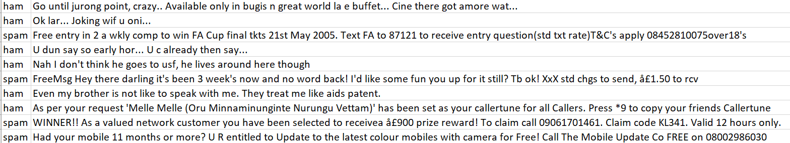

```

In this case

- Documents are emails.
- Vocabulary includes words that appear in _each and every_ emails.

__NOTE:__ Spam detection is clearly a supervised learning task where $Y_i=\{\text{spam, ham}\}$.


---

# Transforming a corpus to a DTM

Consider the following corpus $(D=2)$:

```{r}
txt <- c(doc1 = "Shipment of gold damaged in a fire.",
         doc2 = "Delivery of silver, arrived in 2 silver trucks")

txt %>% quanteda::dfm() # transform text as a document term matrix
```

???

This example is taken from the [quanteda's getting started examples](https://quanteda.io/index.html).


---

# Does every words matter? ¯\\\_(ツ)_/¯

We can significantly reduce the dimension of $\mathbf{X}$ by

- filtering out very common ("stop words") and uncommon words.
- dropping numbers and punctuation.
- stemming, i.e., replacing words by their root. (_economi_ instead of _economics, economists, economy_)
- convert to lower case

__WARNING:__  Use text prepossessing steps with care. These steps should be application specific.

---

# Illustration of some common preprocessing steps

Here, we remove stop words, punctuation, numbers, and stem words:
```{r}
txt <- c(doc1 = "Shipment of gold damaged in a fire.",
         doc2 = "Delivery of silver, arrived in 2 silver trucks")

txt %>% dfm(remove = stopwords("english"),
            remove_punct = TRUE,
            remove_numbers = TRUE,
            stem = TRUE)
```

Note that we are now down from 14 features to 8.

---

# $n$-grams

- Sometimes we might care about multiword expressions, e.g., "not guilty", "labor market", etc. 

- We can define tokens (the basic element of text) as $n$-gram - a sequence of $n$ words from a given sample of text.

__NOTE:__ Using $n$-gram with $n$>2 is typically impractical due to the fact that the column dimension of $\mathbf{X}$ increases exponentially with the order $n$.

---

# DTM with bigrams

Here is our sample text (just 2 "documents" in this example), where tokens are defined as _bi-gram_ (a sequence of two words):

```{r}
txt %>% 
  tokens(remove_punct = TRUE, remove_numbers = TRUE) %>%
  tokens_ngrams() %>% 
  dfm()
```


---

# The (social science) textmining play book


1. Collect text and generate a corpus.

2. Represent corpus as a DTM $\mathbf{X}$.

3. Then, proceed according to one of the following steps:

  - Use $\mathbf{X}$ to predict an outcome $Y$ using high dimensional methods (e.g., lasso, Ridge, etc.). In some cases, proceed with $\hat{Y}$ to subsequent analysis.
  
  - Apply dimensionality reduction techniques (dictionary, PCA, LDA, etc.) to $\mathbf{X}$ and proceed with the output $\mathbf{F}$ to subsequent analysis.

Remember:

> "_Text information is usually best as part of a larger system.
Use text data to fill in the cracks around what you know.
Don’t ignore good variables with stronger signal than text!_" (Matt Taddy)

---
class: title-slide-section-blue, center, middle
name: reg

# Text Regression


---

# This will sound familiar...


- We are interested in predicting some $Y$ using $\mathbf{X}$.

- Clearly, with text as data, we are facing the high-dimensionality problem. $\mathbf{X}$ has $M \times N$ elements.

- Classical methods such as OLS won't do the trick $\Rightarrow$ need the ML touch.

- An obvious choice would be penalized linear/non-linear regression (e.g. Lasso, ridge, etc.). Other methods such as random forest can work too.

__EXAMPLE:__ Lasso text regression `glmnet(Y, X)` where

$$\hat{\beta}=\underset{\beta\in \mathbb{R}^N}{\operatorname{argmin}} \sum_{i=1}^N\left(Y_{i}-X_{i} \beta\right)^{2}+\lambda \lVert\boldsymbol{\beta}\rVert_1$$
Can be easily extended to binary / categorical $Y$, e.g. `glmnet(X, Y, family = "binomial")`

---

# Practical advice about using penalized text regression

- Typically, DTM entries count the number of times word $i$ appears in document $d$. This provide "intuitive" interpretation for regression coefficients.

- Depending on the application, Other transformation for $\mathbf{X}$ might be more appropriate, e.g.,
  - normalization of each row by document length.
  - binary inclusion dummy (instead of count).

- Nevertheless, beware of giving a causal interpretation to the Lasso's coefficients. (Recall the irrepresentability condition.)


---
class: title-slide-section-blue, center, middle
name: dict

# Dictionary-based Methods


---

# Reducing dimensionality using dictionaries

- Dictionary-based methods provide a low-dimensional representation of high-dimensional text.

- This is by far the most common method in the social science literature using text to date (Gentzkow et al. forthcoming).

- Essentially, Think of $F$ as an unobserved characteristic of the text that we are trying to estimate. A Dictionary-based methods provides a mapping from $\mathbf{X}$ onto a low dimensional $F$:

$$g: \mathbf{X}\rightarrow F$$

---

# Example: Sentiment analysis


- A prominent example of dictionary-based methods is sentiment analysis

- The latent factor we are trying to estimate is the writer's attitude towards the topic in question.

- The most common approach is based on pre-specified dictionaries that classify word according to some predefined sentiment class (e.g. "positive", "negative", and "neutral".)

- Typically, the sentiment _score_ of each document is a function of the relative frequencies of positive, negative, neutral, etc., words.


__REMARK__: Sentiment analysis can be supervised as well. E.g., the availability of labeled movie reviews (1-5 stars) can be used to train a model and use its predictions to classify unlabeled reviews.

---

# Example: Loughran and McDonald financial sentiment dictionary

A random list of words from the Loughran and McDonald (2011) financial sentiment dictionary (positive/negative/litigious/uncertainty/constraining):

```{r}
library(tidytext)
sample_n(get_sentiments("loughran"),8)
```


---
# Application: Bank of Israel Communication


```{r, echo=FALSE, out.width = "70%", fig.align='center'}

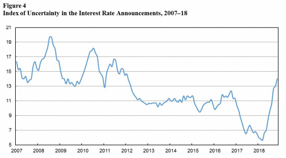

```

Source: [Benchimol and Caspi (2019)](https://www.boi.org.il/en/NewsAndPublications/PressReleases/Documents/Measuring%20Communication%20Quality%20in%20the%20Interest%20Rate%20Announcements.pdf)
---
class: title-slide-section-blue, center, middle
name: lda

# Topic Modeling


---

# Topic models

- Topic models extend unsupervised learning methods to text data.

- Topic modeling classifies documents and words to latent topics and is often followed by more conventional empirical methods.

- The workhorse of topic modeling is the Latent Dirichlet Allocation model (Blei, Ng, and Jordan, 2003), or LDA for short.


---

# Intuition behind LDA

```{r, echo=FALSE, out.width = "55%", fig.align='center'}

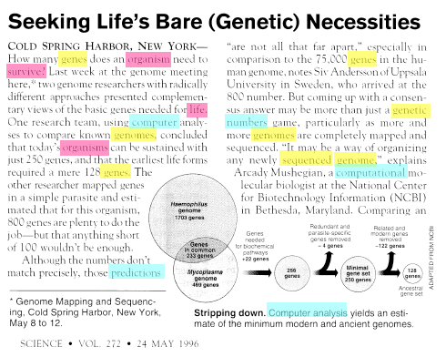

```


---

# Intuition behind LDA

```{r, echo=FALSE, out.width = "65%", fig.align='center'}

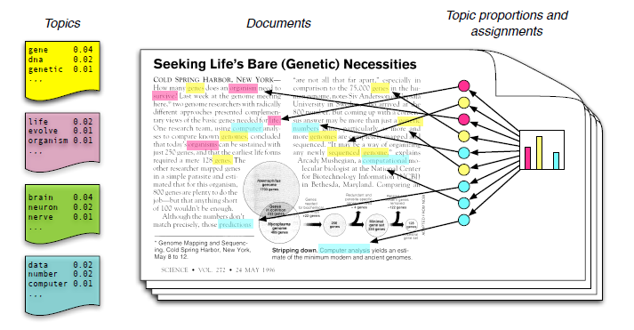

```

- A topic is a distribution over _all_ the words included in a _fixed_ vocabulary.
- A word can have non-zero (yet different) probability multiple topics (e.g., bank)
- Each document is a mixture of topics
- Each word is drawn from one of the topics.

---

# Intuition behind LDA

```{r, echo=FALSE, out.width = "65%", fig.align='center'}

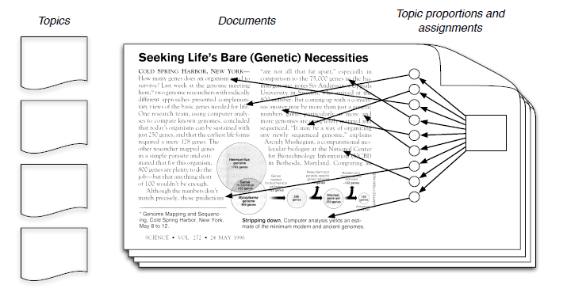

```

__QUESTION:__ How realistic is the LDA setup? Does it matter? What's our goal here anyway?


---

# Notation

- A _vocabulary_ is a collection of words represented by the vector $\{1,\dots,V\}$

- Each _word_ is represented by a unit vector $\boldsymbol{\delta}_v=(0,\dots,v,\dots,0)'$

- A _document_ is a sequence of $N$ words denoted by $\mathbf{w}=(w_1,\dots,w_N)$.

- A _corpus_ is a collection of $M$ documents denoted by $\mathcal{D}=(\mathbf{w}_1,\dots,\mathbf{w}_M)$.


---

# Prerequisite: The Beta distribution

.pull-left[


The PDF for the Beta distribution, denoted as $B(\alpha,\beta)$ is

$$p(\theta|\alpha,\beta)\propto \theta^{\alpha-1}(1-\theta)^{\beta-1}$$
for $\theta\in[0,1]$ and $\alpha,\beta>0$.


Because its properties, the Beta distribution is useful as a prior for probabilities.

]
.pull-right[
```{r, echo=FALSE, out.width = "100%", fig.align='center'}

knitr::include_graphics("https://upload.wikimedia.org/wikipedia/commons/thumb/f/f3/Beta_distribution_pdf.svg/325px-Beta_distribution_pdf.svg.png")

```
]


---

# The Dirichlet distribution

The Dirichlet distribution, denoted as $\text{Dir}(\boldsymbol{\alpha})$ is a multivariate generalization of the Beta distribution.

Let $\mathbf{\theta}=(\theta_1, \theta_2,\dots,\theta_K)\sim\text{Dir}(\boldsymbol{\alpha})$. 

The PDF for a $K$-dimensional Dirichlet distribution is

$$p(\boldsymbol{\theta}|\boldsymbol{\alpha})\propto \prod_{i=1}^{K} \theta_{i}^{\alpha_{i}-1}$$
where $K\geq2$ is the number of categories, $\alpha_i>0$ and $\theta_{i}\in(0,1)$ for all $i$ and $\sum_{i=1}^{K} \theta_{i}=1$.

__REMARK: __ The parameter $\boldsymbol{\alpha}$ controls the sparsity of $\boldsymbol{\theta}$

__BOTTOM LINE: __Vectors drawn from a Dirichlet distribution represent probabilities.

---

.pull-left[

__On the right:__

The change in the density function $(K = 3)$ as the vector $\boldsymbol{\alpha}$ changes from $\boldsymbol{\alpha} = (0.3, 0.3, 0.3)$ to $(2.0, 2.0, 2.0)$, while keeping $\alpha_1=\alpha_2=\alpha_3$.

__REMARK:__ Placing $\boldsymbol{\alpha}=(1,1,1)$ results in a uniform distribution over the simplex.

]
.pull-right[
<p><a href="https://commons.wikimedia.org/wiki/File:LogDirichletDensity-alpha_0.3_to_alpha_2.0.gif#/media/File:LogDirichletDensity-alpha_0.3_to_alpha_2.0.gif"></a><br>By <a href="https://en.wikipedia.org/wiki/en:File:LogDirichletDensity-alpha_0.1_to_alpha_1.9.gif" class="extiw" title="w:en:File:LogDirichletDensity-alpha 0.1 to alpha 1.9.gif">Initial version</a> by <a href="//commons.wikimedia.org/w/index.php?title=Panos_Ipeirotis&amp;action=edit&amp;redlink=1" class="new" title="Panos Ipeirotis (page does not exist)">Panos Ipeirotis</a>, later modified by <a href="//commons.wikimedia.org/w/index.php?title=User:Love_Sun_and_Dreams&amp;action=edit&amp;redlink=1" class="new" title="User:Love Sun and Dreams (page does not exist)">Love Sun and Dreams</a> - <a class="external autonumber" href="http://en.wikipedia.org/wiki/File:LogDirichletDensity-alpha_0.3_to_alpha_2.0.gif">[1]</a>, <a href="https://creativecommons.org/licenses/by/3.0" title="Creative Commons Attribution 3.0">CC BY 3.0</a>, <a href="https://commons.wikimedia.org/w/index.php?curid=10073606">Link</a></p>
]


---

# The data generating process behind LDA

__Assumption:__ The number of topics $K$ and the size of the vocabulary $V$ are fixed.


The DGP: 

For each document $d=1,\dots,\mathcal{D}$

1. Choose topic proportions $\theta_d\sim\text{Dir}(\boldsymbol{\alpha})$

2. For each word $n=1,\dots,N$

  2.1. Choose a topic assignment $Z_{dn}\sim\text{Mult}(\theta_d)$.
  
  2.2. Choose a word $W_{dn}\sim\text{Mult}(\beta_{z_{dn}})$.


__REMARK:__ Note the "factor model" aspects of LDA, where topics are factors and word probabilities are loadings, and both affect the probability of choosing a word. 

---

# Aside: Plate notation

```{r, echo=FALSE, out.width = "45%", fig.align='center'}

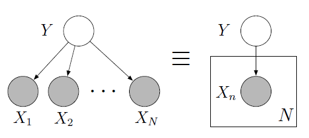

```

- Each _node_ is a random variable
- _Shaded_ nodes are observables
- _Edges_ denote dependence
- _plates_ denote replicated structures

The above graph corresponds to 

$$p\left(y, x_{1}, \ldots, x_{N}\right)=p(y) \prod_{n=1}^{N} p\left(x_{n} | y\right)$$

---

# LDA in plate notation

```{r, echo=FALSE, out.width = "70%", fig.align='center'}

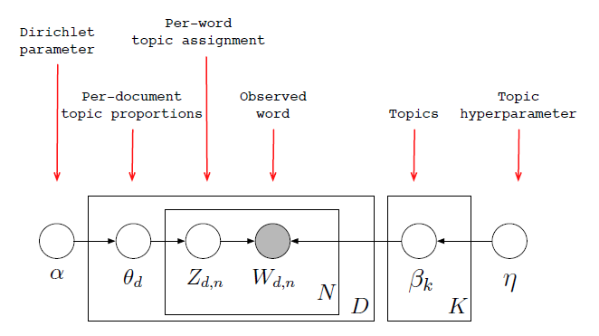

```

_Source_: [http://videolectures.net/mlss09uk_blei_tm/#](http://videolectures.net/mlss09uk_blei_tm/#).

---

# Aside: Conjugate priors


The Dirichlet distribution is a conjugate prior for the Multinomial. 

Let $n(Z_{i})$ denote the count of topic $i$.

$$\boldsymbol{\theta}|Z_{1,\dots,N}\sim \text{Dir}(\boldsymbol{\alpha}+n(Z_{1,\dots,N}))$$

i.e., as the number of times we see topic $i$ increases, our posterior becomes "peakier" at its $i^{\text{th}}$ component.


---

#Extension #1: Correlated topic models (Lafferty and Blei, 2005)

- LDA assumes that topics independently cooccure in documents. 

- This is clearly wrong.

- For example, a document about _economics _ is more likely to also be about _politics_ than it is to be about _cooking_.

- Lafferty and Blei relax independence by drawing topic proportions from a logistic normal, which allows correlations between topic proportions:


```{r, echo=FALSE, out.width = "50%", fig.align='center'}

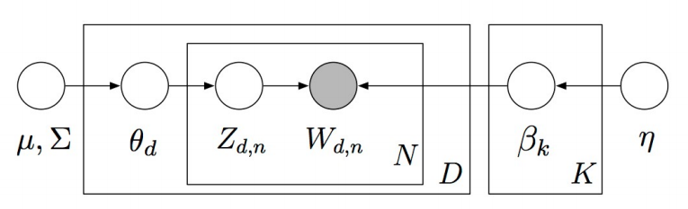

```

where $\mu$ and $\Sigma$ are priors for the logistic normal distribution.


---
# Extension #2: Dynamic LDA (Blei and Lafferty, 2006)

.pull-left[
Dynamic topic modeling takes into account the ordering of the documents and gives a richer posterior topical structure than LDA

In dynamic topic modeling, a topic is a _sequence_ of distributions over words. Topics evolve systematically over time. In particular, the vector of parameters for topic $k$ in period $t$ evolves with a Gaussian noise:

$$\beta_{t, k} | \beta_{t-1, k} \sim \mathcal{N}\left(\beta_{t-1, k}, \sigma^{2} I\right).$$
]
.pull-right[
```{r, echo=FALSE, out.width = "100%", fig.align='center'}

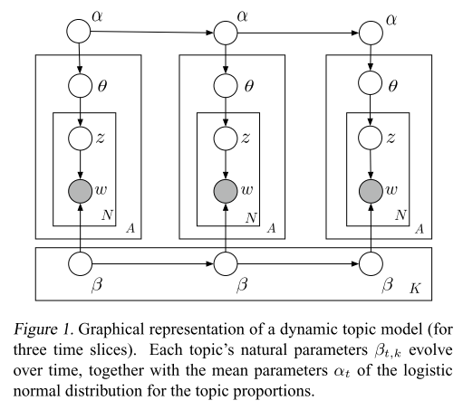

```
]


---

# Dynamic LDA: _Science_, 1881-1999

The posterior estimate of the frequency as a function of year of several words from the two topics: "Theoretical Physics" and "Neuroscience":

```{r, echo=FALSE, out.width = "60%", fig.align='center'}

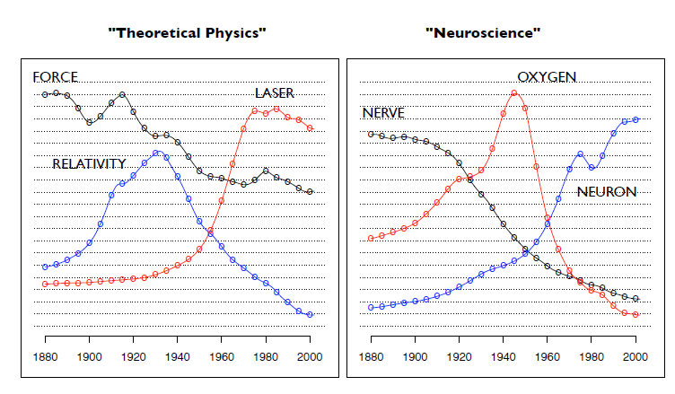

```
_Source_: Blei and Lafferty (2006).


---

# Extension #3: Supervised Topic Model (McAuliffe and Blei, 2008)


add an extra connection between $Z_{dn}$ to some observable attribute $Y_d$:

```{r, echo=FALSE, out.width = "50%", fig.align='center'}

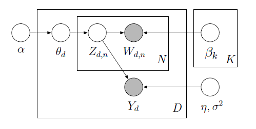

```

_Source_: McAuliffe and Blei (2008).

---

# Structural Topic Models (Roberts, Stewart, and Tingley)


About the Structural Topic Model (STM):

> _"The Structural Topic Model is a general framework for topic modeling with document-level covariate information. The covariates can improve inference and qualitative interpretability and are allowed to affect topical prevalence, topical content or both."_

In STM, topics are drawn from the following logistic normal distribution,

$$\boldsymbol{\theta}_{d} | X_{d} \gamma, \Sigma \sim \text { LogisticNormal }\left(\mu=X_{d} \gamma, \Sigma\right)$$

where $X_{d}$ is a vector of observed document covariates.


__REMARK:__ In the case of no covariates, the STM reduces to a (fast) implementation of the Correlated Topic Model (Blei and Lafferty, 2007).
---

# `stm`: R package for structural topic models 
## Roberts, Stewart, and Tingley (JSS, 2014)

About the `stm` R package:

> _"The software package implements the estimation algorithms for the model and also includes tools for every stage of a standard workflow from reading in and processing raw text through making publication quality figures."_

The package is available on CRAN and can be installed using:

```r
install.packages("stm")
```
To get started, see the [vignette](https://github.com/bstewart/stm/blob/master/inst/doc/stmVignette.pdf?raw=true) which includes several example analyses.


---

# Applying topic models to measure the effect of transparency

Hansen, McMahon, and Prat (QJE 2017) study the effect of increasing Federal Open Market Committee (FOMC) transparency on debate during FOMC meetings.

- FOMC meetings have been tape recorded since the 1970s to prepare minutes.

- Committee members believed that these tapes were erased afterward.

- In October 1993, Fed chair Alan Greenspan ,discovered and revealed that before being erased the tapes had been transcribed and stored in archives all along.

- Following Greenspan's revelation The Fed agreed to publish all past transcripts and extended that policy to cover all future transcripts with a five-year lag.

- This gives Hansen et al. access to periods both when policy makers did and did not believe their deliberations would be public.


---

# Topic modeling of FOMC meeting transcripts

Data:

- 149 FOMC meeting transcripts during, Alan Greenspan’s tenure, before and after 1993.

- The unit of observation is a member-meeting.

- The outcomes of interest are
  - the proportion of words devoted to the $K$ different topics
  - the concentration of these topic weights
  - the frequency of data citation.

---

# Estimation

- Estimate topics using LDA.

- Use LDA's output to construct outcomes of interest

- Difference / Difference-in-differences regressions that estimate the effects of the change in transparency on outcomes. For example, Hansen et al. estimate

$$y_{i t}=\alpha_{i}+\gamma D(\text {Trans})_{t}+\lambda X_{t}+\varepsilon_{i t}$$

- where 
  - $y_{it}$ represents any of the communication measures for member $i$ in time $t$.
  - $D(\text{Trans})$ is an indicator for being in the transparency regime (1 after November 1993, 0 before).
  - $X_t$ is a vector of macro controls for the meeting at time $t$. 


---

# Pro-cyclical topics

```{r, echo=FALSE, out.width = "45%", fig.align='center'}

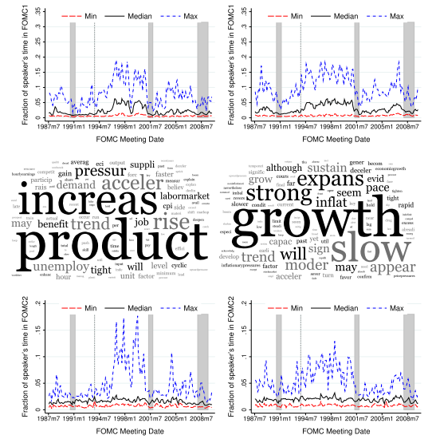

```
_Source_: Hansen, McMahon, and Prat (QJE 2017).


---

# Counter-cyclical topics

```{r, echo=FALSE, out.width = "43%", fig.align='center'}

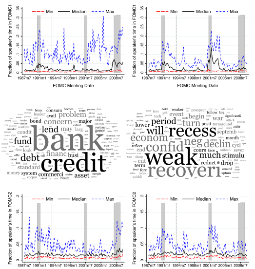

```
_Source_: Hansen, McMahon, and Prat (QJE 2017).

---

# Increased accountability: More references to data

```{r, echo=FALSE, out.width = "45%", fig.align='center'}

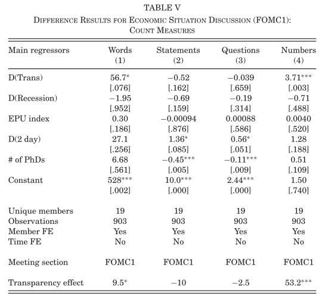

```

_Source_: Hansen, McMahon, and Prat (QJE 2017).
---

# Increased conformity: increased document similarity

```{r, echo=FALSE, out.width = "40%", fig.align='center'}

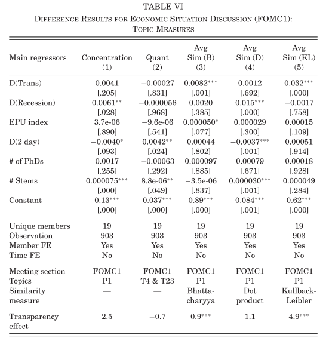

```

_Source_: Hansen, McMahon, and Prat (QJE 2017).


---
class: .title-slide-final, center, inverse, middle

# `slides %>% end()`

[<i class="fa fa-github"></i> Source code](https://github.com/ml4econ/notes-spring2019/tree/master/11-text-mining)  


---
# Selected references

Blei, D. M., Ng, A. Y., & Jordan, M. I. (2003). Latent Dirichlet allocation. _Journal of Machine Learning Research_, 3(Jan), 993-1022.

Blei, D. M., & Lafferty, J. D. (2006, June). Dynamic topic models. In _Proceedings of the 23rd international conference on Machine learning_ (pp. 113-120). ACM.

Gentzkow, M., Kelly, B.T. and Taddy, M. (forthcoming). _The Quarterly Journal of Economics_. 

Hansen, S., McMahon, M., & Prat, A. (2017). Transparency and Deliberation Within the FOMC: A Computational Linguistics Approach. _The Quarterly Journal of Economics_, 133(2), 801–870.

Lafferty, J. D., & Blei, D. M. (2006). Correlated topic models. In _Advances in neural information processing systems_ (pp. 147-154).

Loughran, T. and McDonald, B., 2011. When is a liability not a liability? Textual analysis, dictionaries, and 10‐Ks. _The Journal of Finance_, 66(1), pp.35-65.

---
# Selected references

Roberts, M.E., Stewart, B.M., Tingley, D., Lucas, C., Leder‐Luis, J., Gadarian, S.K., Albertson, B. and Rand, D.G., 2014. Structural topic models for open‐ended survey responses. _American Journal of Political Science_, 58(4), pp.1064-1082.

Roberts, M.E., Stewart, B.M. and Tingley, D., 2014. stm: R package for structural topic models. _Journal of Statistical Software_, 10(2), pp.1-40.
