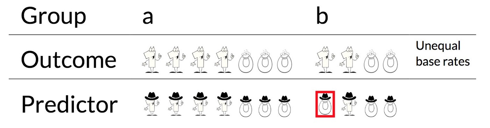

```{r packages, echo=FALSE, message=FALSE, warning=FALSE}

if (!require("pacman"))
  install.packages("pacman")

pacman::p_load(knitr,
               xaringan,
               RefManageR)

```

```{r setup, include=FALSE}
options(htmltools.dir.version = FALSE)

knitr::opts_chunk$set(eval = TRUE,
                      echo = TRUE,
                      warning = FALSE,
                      message = FALSE,
                      cache = FALSE)

htmltools::tagList(rmarkdown::html_dependency_font_awesome())
```

```{r, references, echo=FALSE, cache=FALSE}
BibOptions(check.entries = FALSE, 
           bib.style = "numeric", 
           cite.style = "authoryear", 
           style = "markdown",
           hyperlink = FALSE, 
           dashed = FALSE)
bib <- ReadBib("refs/refs.bib", check = FALSE)
```

# Outline

- [Prediction Policy Problems](#prediction)

- [Algorithmic Fairness](#fairness)


---
class: title-slide-section-blue, center, middle
name: prediction

# Prediction Policy Problems


---
# Prediction policy problems


What we've covered in the previous two lectures focused on evaluating policy based on causal inference and treatments effects.

Nevertheless, as Kleinberg, Ludwig, Mullainathan, and Obermeyer (AER 2015) point out, some policy decisions solely depend on prediction:

- Which teacher is best? (Hiring, promotion)
- Unemployment spell length? (Savings)
- Risk of violation of regulation (Health inspections)
- Riskiest youth (Targeting interventions)
- Creditworthiness (Granting loans) 


---
# Illustration

Consider the following toy example from Kleinberg, Ludwig, Mullainathan, and Obermeyer (AER 2015):

- $Y=\{\text{rain},\text{no rain}\}$
- $X$ atmospheric conditions
- $D$ is a binary policy decision
- $\Pi(Y,D)$ payoff (utility)

The change in payoff resulting from a policy decision is given by

$$\frac{\partial \Pi}{\partial D}=\frac{\partial \Pi}{\partial D} \underbrace{(Y)}_{\text { prediction }}+\frac{\partial \Pi}{\partial Y} \underbrace{\frac{\partial Y}{\partial D}}_{\text { causation }}$$

---

# Rain dance vs. umbrella 

```{r, echo=FALSE, out.width = "70%", fig.align='center'}

include_graphics("figs/rain.png")

```


---

# Real life prediction policy problem: Joint replacement

Over 750,000 joint replacements every year in the US.

  - Benefits: Improved mobility and reduced pain.

  - Costs: $\sim$ $15, 000 + painful recovery from surgery.


Working assumption: Benefits $\Pi$ depend on longevity $Y$.

__QUESTION:__ Can we improve resource allocation by predicting which
surgeries will be futile using data available at the time of the surgery?


---

# Joint replacement DAG

```{r, echo=FALSE, out.width = "30%", fig.align='center'}

include_graphics("figs/joint.png")

```


_Note_: Kleinberg et al. (2015) abstract from surgical risk.


---
# The data

- A 20% sample of 7.4 million Medicare beneficiaries, 98,090 (1.3%) of which had a claim for joint replacement in 2010.

- 1.4 percent of this sample die in the month after surgery, potentially from complications of the surgery itself, and 4.2 percent die in the 1–12 months after surgery.

- Average mortality rate $\sim$ 5% - _on average_, surgeries are not futile.

- This is perhaps misleading. A more appropriate question is whether surgeries on the predictably riskiest patients were futile.

---
# Predicting mortality risk

Kleinberg et al. setup:

- _Outcome_: mortality in 1-12 months
- _Features_: Medicare claims dated prior to joint replacement, including patient demographics (age, sex, geography); co-morbidities, symptoms, injuries, acute conditions, and their evolution over time; and health-care utilization.
- _Sample_: training sample 65K observations / test sample, 33K observations
- _ML algorithm_: Lasso

The play book: 
- Put beneficiaries from the test-set into percentiles by model predicted mortality risk.
- Attache to each percentile its corresponding share of surgeries.
- Show that an algorithm can do better then physicians.

---
# The riskiest people receiving joint replacement

.pull-left[
```{r, echo=FALSE, out.width = "60%", fig.align='center'}


```
_Source_: Kleinberg et al. (2015).


]
.pull-right[
How to read this table

- column 1: Percentile by model predicted mortality risk
- column 2: Actual 1-12 months mortality risk
- column 3: Annual number of surgeries

For example, The riskiest beneficiaries go through 4,905 surgeries even though 56.2% of them are expected to die within 1-12 months, i.e., more than half of these surgeries are expected to be futile. 
]

---
# Can an algorithm do better than physicians?


The first econometric challenge in prediction policy:

> __Selective labels__: We only observe those who got surgery.


How to construct a counterfactual?

- Look at patients eligible for replacement who didn't get it. 

- Working assumption: Physicians allocate replacements to the least risky first.


---
# So, can the lasso beat physicians?


.pull-left[
```{r, echo=FALSE, out.width = "100%", fig.align='center'}

include_graphics("figs/table2_hip_cont_2.png")

```
_Source_: Kleinberg et al. (2015).


]
.pull-right[

__Simulation__: substitute riskiest recipients with those who might have benefited from joint replacement procedures (drawn from _median_ predicted risk) under Medicare eligibility guidelines, but did not receive treatment.


For example: _"Replacing the riskiest 10 percent with lower-risk eligibles would avert 13,350 futile surgeries and reallocate the 200 million per year to people who benefit from the surgery, at the [...] cost of postponing joint replacement for 35,695 of the riskiest beneficiaries who would not have died."_ (Kleinberg et al., 2015)
]


???

Note that the numbers that appear in this slide, taken from Susan Athey's presentation on "Policy Prediction Problems", are slightly different that those that appear in Kleinberg et al., (2015).

---
# What can go wrong?

.pull-left[
The second econometric issue with prediction policy problems:

> __Omitted payoff bias__: What if the unobserved objective (payoff) physicians see include other variables?

__EXAMPLE:__ Patients with high mortality benefit most in terms of pain reduction.

We can assess omitted payoff bias based on observable post-replacement outcomes, e.g., number of visits to physicians for osteoarthritis and multiple claims for physical therapy or therapeutic joint injections.

]

--

.pull-right[

Higher mortality-risk shows no sign of higher benefits.

```{r, echo=FALSE, out.width = "90%", fig.align='center'}

include_graphics("figs/table2_hip_cont.png")

```

]


---

# Leveling the playing field

Before we can compare decision making made by humans and ML algorithms we need to make sure we've leveled the playing field.

In particular, a fair comparison human decision makers and algorithms necessitates that both "competitors" have:
 
- Access to the entire pre-decision information set.
- The same objective function.


---

# Main takeaways from prediction policy problems

- Better ML models do not necessarily imply better decision making

- Insights from the social sciences can help analyze and improve algorithmic decision making.


---
class: title-slide-section-blue, center, middle
name: fairness

# Algorithmic Fairness


---
# Fairness??

```{r, echo=FALSE, out.width = "70%", fig.align='center'}


```

_Source:_ [https://towardsdatascience.com/a-tutorial-on-fairness-in-machine-learning-3ff8ba1040cb](https://towardsdatascience.com/a-tutorial-on-fairness-in-machine-learning-3ff8ba1040cb)


---
# ProPublica and COMPASS

["Machine Bias"](https://www.propublica.org/article/machine-bias-risk-assessments-in-criminal-sentencing), by Julia Angwin, Jeff Larson, Surya Mattu and Lauren Kirchner, ProPublica
May 23, 2016

COMPAS, Correctional Offender Management Profiling for Alternative Sanction, is a software, developed by Northpointe which includes algorithm used to assess potential _recidivism_ risk. 


---
# Bias in recidivism risk assessment?


```{r, echo=FALSE, out.width = "90%", fig.align='center'}


```


---
# COMPAS accuracy rates


```{r, echo=FALSE, out.width = "90%", fig.align='center'}


```


---

# Desired fairness properties


Fairness Properties for Risk Assignments (Kleinberg, Mullainathan, and  Raghavan ,2017):

__(A)__ _Calibration within groups_, e.g., the score returned from COMPAS for a defendant within racial group should reflect the probability of re-offending.

__(B)__ _Balance for the negative class_: the assignment of
scores shouldn’t be systematically more inaccurate for negative instances in one group than the other.

__(C)__ _Balance for the positive class_, requires that the average score assigned to people of group 1 who belong to the positive class should be the same as the average score assigned to people of group 2 who belong to the positive class.


---

# An Impossibility theorem of fairness


Kleinberg, Mullainathan, and  Raghavan (2017):

> __Theorem 1.1:__ _Consider an instance of the problem in which there is a risk assignment satisfying fairness conditions (A), (B), and (C). Then the instance must either allow for perfect prediction [...] or have equal base rates._


---
# Illustration

Perfect prediction for group __a__, 1 false positive for group __b__ (1="negative" class, 0="positive" class)


```{r, echo=FALSE, out.width = "90%", fig.align='center'}



```

_Source:_ [https://towardsdatascience.com/a-tutorial-on-fairness-in-machine-learning-3ff8ba1040cb](https://towardsdatascience.com/a-tutorial-on-fairness-in-machine-learning-3ff8ba1040cb)

---
# Illustration

Now, the true positive rates as well as the true negative rates are equal for both groups (both have 1/2 and 1):

```{r, echo=FALSE, out.width = "90%", fig.align='center'}


```

_Source:_ [https://towardsdatascience.com/a-tutorial-on-fairness-in-machine-learning-3ff8ba1040cb](https://towardsdatascience.com/a-tutorial-on-fairness-in-machine-learning-3ff8ba1040cb)


---
# Illustration

Now, balance for the negative class is violated with this setting.

```{r, echo=FALSE, out.width = "90%", fig.align='center'}


```

_Source:_ [https://towardsdatascience.com/a-tutorial-on-fairness-in-machine-learning-3ff8ba1040cb](https://towardsdatascience.com/a-tutorial-on-fairness-in-machine-learning-3ff8ba1040cb)


---
# Back to COMPAS


```{r, echo=FALSE, out.width = "90%", fig.align='center'}


```


Northpointe’s main defense is that risk scores reflect observed probability of re-offending. 


---

# Blind Algorithms

Algorithmic Fairness (Kleinberg, Ludwig, Mullainathan, and Rambachan, AER 2018): 

Can we increase algorithmic fairness by ignoring variables that induce such bias such as race, age, sex, etc.?

Short answer: Not necessarily.


---

# The basic setup

The context: Student admission to college.

Data: $\{Y_i, X_i, R_i\}_{i=1}^N$, where
- $Y_i$ is performance
- $X_i$ is a set of features
- $R_i$ is a binary race indicator where $R_i=1$ for individuals that belong to the minority group and $R_i=0$ otherwise.

Predictors:

- __"Aware"__: $\hat{f}(X_i,R_i)$

- __"Blind"__: $\hat{f}(X_i)$

- __"Orthogonality"__: $\hat{f}(\widetilde{X}_i)$, where $\widetilde{X}_i \perp R_i$.

---

# Definitions

Let $S$ denote the set of admitted students and $\phi(S)$ denote a function that depends only on the predicted performance, measured by $\hat{f}$, of the students in $S$.

__Compatibility condition:__ If $S$ and $S^\prime$ are two sets of students of the same size, sorted in descending order of predicted performance $\widehat{f}(X,R)$, and the predicted performance of the $i^\text{th}$ student in $S$ is at least as large as the predicted performance of the $i^\text{th}$ in $S^\prime$ for all $i$, then $\phi(S)\geq\phi(S^\prime)$.


- The _efficient_ planner maximizes $\phi(S)$ where $\phi(S)$ is compatible with $\hat{f}$.

- The _equitable_ planner seeks to maximize $\phi(S)+\gamma(S)$, where $\phi(S)$ is compatible with $\hat{f}$, and $\gamma(S)$ is monotonically increasing in the number of students in $S$ who have $R=1$.


---

# Main result: Keep $R$ in


Kleinberg et al. (2018) main result:

> THEOREM 1: _For some choice of $K_0$ and $K_1$ with $K_0 + K_1 = K$, the equitable planner’s problem can be optimized by choosing the $K_0$ applicants in the $R = 0$ group with the highest $\widehat{f}(X,R)$, and the $K_1$ applicants in the $R=1$ group with the highest $\widehat{f}(X,R)$._


(See Kleinberg et al., 2018 for a sketch of the proof.)

---

# Intuition

- Good ranking of applicants is desired for both types of planners.

- Equitable planners still care about ranking _within_ groups.

- Achieving a more balanced  acceptance  rate is a _post_ prediction step. Can be adjusted by changing the group-wise threshold.


---

# Illustration of the result

Say that we have $10$ open slots, $100$ admissions from the majority group $(R=0)$ and $20$ form the minority group $(R=1)$. In addition, assume that the acceptance rate for the minority group is set to $30\%$.

An equitable planner should:
1. Rank candidates within each group according to $\widehat{f}(X_i,R_i)$.

2. Accept the top $7$ from the $R=0$ group, and top $3$ from the $R=1$ group.


---

# Empirical application

.pull-left[

__DATA: __Panel data on This representative sample of students who entered eighth grade in the fall of 1988, and who were then followed up in 1990, 1992, 1994, and mid-20s).

__OUTCOME:__ GPA $\geq$ 2.75.

__FEATURES:__ High school grades, course taking patterns, extracurricular activities, standardized test scores, etc.

__RACE:__ White $(N_0=4,274)$ and black $(N_1=469)$.

__PREDICTORS:__ OLS (random forest for robustness)

]
.pull-right[

__RESULT:__ The "aware" predictor dominates for both efficient planner and equitable planner.

```{r, echo=FALSE, out.width = "100%", fig.align='center'}


```
]

---

# Sources of disagreement

.pull-left[

- On the right: The distribution of black students in the sample across predicted-outcome deciles according to the race-blind or race-aware predictors.


- How to read this: In the case of agreement between race-blind and race-aware, the values would be aligned on the main diagonal. By contrast, disagreement is characterized by off-diagonal non-zero values.

- Bottom line (again): Adding race to the equation improves within group ranking.

]
.pull-right[


```{r, echo=FALSE, out.width = "90%", fig.align='center'}

include_graphics("figs/fig2.png")

```
]

---

# Main takeaways

- Turning algorithms blind might actually do harm.

- What actually matters is the rankings within groups.

- Caveat: This is a very specific setup and source of bias.

---
class: .title-slide-final, center, inverse, middle

# `slides %>% end()`

[<i class="fa fa-github"></i> Source code](https://github.com/ml4econ/lecture-notes-2021/tree/master/12-pred-policy)  


---
# Selected references


Angwin, Julia, Jeff Larson, Surya Mattu, and Lauren Kirchner. 2016. “Machine Bias.” _ProPublica_, May 23. [https://www.propublica.org/article/machine-bias-risk-assessments-in-criminal-sentencing.](https://www.propublica.org/article/machine-bias-risk-assesments-in-criminal-sentencing.)

Athey, S. (2018). The Impact of Machine Learning on Economics. 

Athey, S., & Wager, S. (2018). Efficient Policy Learning.

Kleinberg, B. J., Ludwig, J., Mullainathan, S., & Obermeyer, Z. (2015). Prediction Policy Problems. _American Economic Review: Papers & Proceedings_, 105(5), 491–495.

Kleinberg, B. J., Ludwig, J., Mullainathan, S., & Rambachan, A. (2018). Algorithmic Fairness. _American Economic Review: Papers & Proceedings_, 108, 22–27.

---
# Selected references


Kleinberg, J., Lakkaraju, H., Leskovec, J., Ludwig, J., & Mullainathan, S. (2018). Human Descisions and Machine Predictions. _Quarterly Journal of Economics_, 133(1), 237–293.

Kleinberg, J., Mullainathan, S., & Raghavan, M. (2017). Inherent Trade-Offs in the Fair Determination of Risk Scores. _Proceedings of the 8th Conference on Innovation in Theoretical Computer Science_, 43, 1–23.

Mullainathan, S., & Spiess, J. (2017). Machine Learning: An Applied Econometric Approach. _Journal of Economic Perspectives_, 31(2), 87–106.

